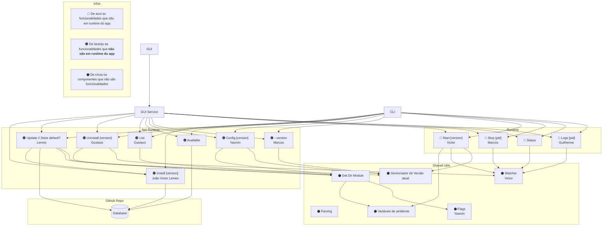

# Requisitos da Aplicação

## Descrição

Este sistema permite que você gerencie e interaja com processos em segundo plano por meio de uma interface de linha de comando (CLI) e de uma interface gráfica de usuário (GUI). Ele inclui funcionalidades para gerenciar a versão, instalar, atualizar e desinstalar pacotes, bem como iniciar, parar, monitorar e obter logs de processos. A aplicação é construída em Go e usa bibliotecas como `cobra`, `formatador de output`, e `gui`.

## Arquitetura

Os módulos que são consumidos pela CLI e pelo GUI service devem ser "interface agnósticos". Ou seja, não devem ter funcionalidades de I/O. Tal caracterítica será delegada para os módulos CLI e GUI.

Os módulos de funcionalidade conterão apenas a lógica de funcionamento interna.

## Estrutura do Projeto

### 1. **Pacotes**
A aplicação será organizada em pacotes, sendo cada um responsável por uma parte do sistema:

- **Pacote `main`**: Contém o código principal da aplicação, isolado para garantir que as funcionalidades essenciais sejam carregadas corretamente.
- **Pacote `common`**: Contém funções utilitárias e recursos compartilhados entre outros pacotes.
- **Pacote `cli`**: Implementa a interface de linha de comando utilizando a biblioteca `cobra`.
- **Pacote `gui`**: Implementa a interface gráfica de usuário (GUI), com suporte a interação visual para o gerenciamento dos processos em segundo plano.
- **Subpacotes**: Pequenos pacotes auxiliares ou específicos que podem ser usados dentro de um dos pacotes principais, como formatação de saída.

### 2. **Dependências**
- **cobra**: Biblioteca para criação de interfaces de linha de comando.
- **Formatador de output**: Responsável pela formatação da saída do CLI e GUI.
- **GUI**: Responsável pela interface gráfica do usuário.

### 3. **Estrutura de Branches**
- **Main Branch**: Branch principal, contém a versão estável da aplicação.
- **Branches de Feature**: Cada nova funcionalidade será desenvolvida em uma branch separada, garantindo modularidade e controle de versão.

### 4. **Versão**
A versão da aplicação será controlada pelo CLI e pela GUI. A aplicação irá verificar a versão do sistema e fornecer o comando `--version` para exibir a versão atual.

---

## Funcionalidades

### 1. **CLI**
A interface de linha de comando será baseada no pacote `cobra` e suportará os seguintes comandos e parâmetros:

- **`--version`**: Exibe a versão atual da aplicação.
- **`install x`**: Instala o pacote ou módulo especificado.
- **`update`**: Atualiza a aplicação ou pacotes já instalados.
- **`uninstall`**: Desinstala o pacote ou módulo especificado.
- **`list`**: Lista os pacotes instalados ou processos em execução.
- **`config`**: Configura o sistema ou parâmetros da aplicação.
- **`start x - watcher y`**: Inicia um processo em segundo plano e configura um "watcher" para monitoramento.
- **`stop (pid)`**: Para o processo com o PID especificado.
- **`status x`**: Mostra o status do processo ou pacote `x`.
- **`logs (pid) x`**: Exibe os logs do processo com o PID especificado.

### 2. **GUI**
A interface gráfica permitirá o gerenciamento dos processos em segundo plano de maneira mais visual. Ela incluirá os seguintes recursos:

- **Exibição de status**: Mostrar o status de processos em execução.
- **Gerenciamento de pacotes**: Instalar, desinstalar, listar pacotes e atualizá-los.
- **Acompanhamento de logs**: Visualizar os logs dos processos em execução.
- **Controle de processos**: Iniciar e parar processos diretamente pela interface gráfica.

### 3. **Execução em Segundo Plano**
Todos os processos serão executados em segundo plano. A CLI e a GUI fornecerão ferramentas para iniciar, monitorar e parar esses processos. O sistema deve ser capaz de rodar múltiplos processos simultaneamente.

---

## Requisitos Técnicos

### 1. **Tecnologias**
- **Linguagem**: Go (versão 1.20 ou superior).
- **Dependências**:
  - `cobra` (para CLI).
  - Formatador de saída.
  - Interface gráfica (GUI).

### 2. **Configuração do Ambiente**
- A configuração do projeto deve garantir um ambiente de desenvolvimento adequado:
  - **Pacote `main` isolado**: O código principal deve ser isolado, sem dependências diretas dos outros pacotes.
  - **Estrutura modular**: Todos os pacotes devem ser independentes e responsáveis por uma parte da funcionalidade.
  
### 3. **Monitoramento e Logs**
- O sistema deve ser capaz de registrar logs detalhados de cada processo em execução, com suporte para consulta através da CLI e GUI.

## Separação das features
- Guilherme: GUI e Logs
- Gustavo: Uninstall e List
- Marcos: Version e Stop
- Yasmin: Config e Flags
- Lemes: Install e Update
- Victor: Watcher e Start

## Etapas

### Etapa 01: 27/03 - 15/04
- GUI
- Watcher
- List
- Config
- Install
